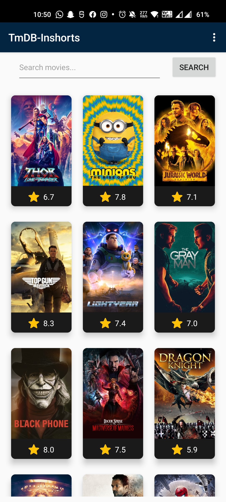
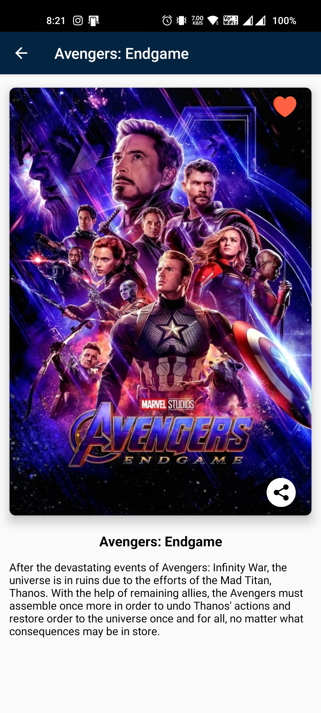
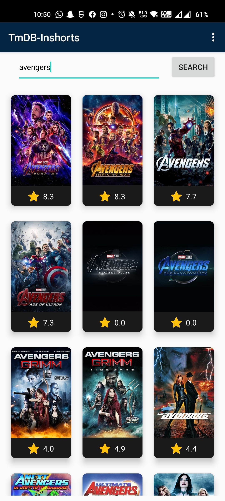
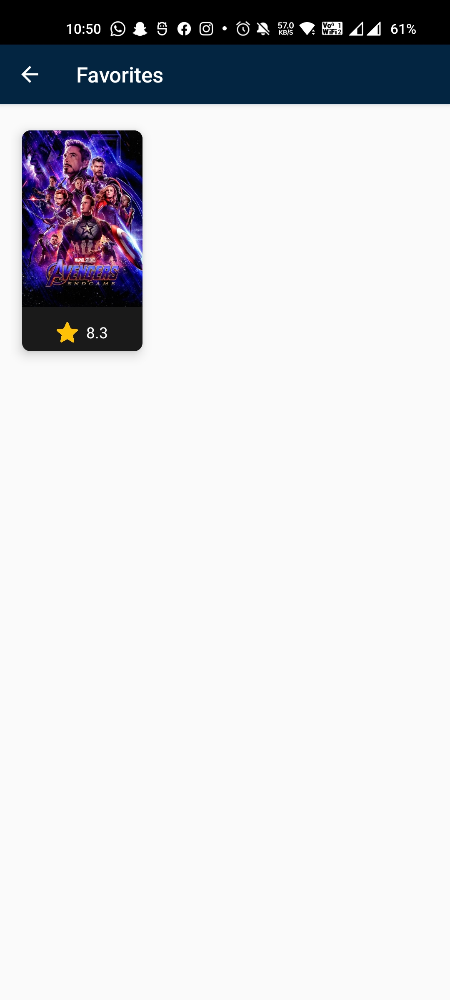

# TmDB-Inshorts

Apk Link : https://drive.google.com/drive/folders/1qogyLXXfNHczuHmzackmWQkH87LOWM5f?usp=sharing

App built with MVVM + Retrofit + Offline Functinality

Get your API KEY FROM TMDB's website. This App includes:

Swipe Refresh,
Databinding,
RoomDatabase,
ViewModel,
Retrofit2,
CardView, RecyclerView,
Offline Functionality

  
  
  
  

